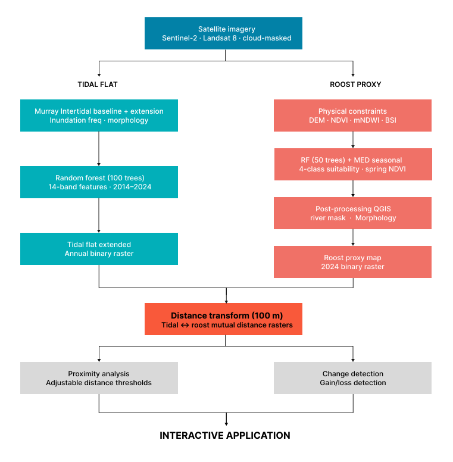

<style>
.scroll-code {
  max-height: 300px;
  overflow-y: auto;
  border: 1px solid #e1e1e1;
  border-radius: 8px;
  box-shadow: none;
  background-color: transparent; 
}


.scroll-code pre, 
.scroll-code .sourceCode {
  margin: 0 !important;      
  padding: 10px !important;  
  background-color: #282c34 !important; 
  border: none !important; 
}
</style>

---
title-block-banner: images/picture1.jpg
title: "Lianyungang Blue Corridor: Estuarine Habitat Dynamics for Migratory Birds"
css: styles.css
---

## Project Summary 

Fill in the sections below to provide a brief summary of your project. Each section should have no more than 100 words. Do not edit any of the headings.

### Problem Statement 

Lianyungang's coastal wetlands sit on the East Asian–Australasian Flyway, providing critical stopover habitat for migratory shorebirds including globally threatened species. 
  
Despite China's post-2018 reclamation moratorium and the Blue Bay remediation programme, coastal development continues to encroach on intertidal flats. 
  
Lianyungang was removed from the Yellow Sea World Heritage nomination shortlist in 2022 following contested environmental impact assessments. Ongoing litigation between conservation NGOs and development authorities highlights a persistent gap: the lack of spatially explicit, reproducible tools to evaluate where development pressures conflict with shorebird habitat. 

This application provides a low-cost, satellite-based proxy tool for rapid broad-scale identification of potential habitat loss and development conflict zones, helping prioritise areas that warrant further detailed field assessment.


## End User 

Who are you building this application for? How does it address a need this community has?

  Coastal wetland managers and conservation planners within China's natural resources agencies and environmental NGOs.
  
  Identify priority areas for protection or restoration across large stretches of coastline before committing to expensive field surveys.
  
  Enables users to rapidly narrow down candidate sites where tidal flat loss, roosting habitat degradation, or coastal squeeze risk is highest, directing limited survey resources more efficiently.


## Data

<style>
.data-table {
  width: 100%;
  border-collapse: collapse;
  font-family: Inter, system-ui, sans-serif;
  background-color: #0d0d0d;
  color: #e8e8e8;
  border: 1px solid #333;
  border-radius: 8px;
}

.data-table th {
  background-color: #1a1a1a;
  color: #a0a0a0;
  font-weight: 600;
  font-size: 0.82rem;
  text-transform: uppercase;
  letter-spacing: 0.06em;
  padding: 12px 16px;
  border-bottom: 1px solid #444;
  text-align: left;
}

.data-table td {
  padding: 11px 16px;
  border-top: 1px solid #222;
  vertical-align: middle;
  color: #e8e8e8;
}

/* Category */
.data-table td.cat {
  font-weight: 700;
  color: #7eb8f7;
  text-align: center;
  border-right: 1px solid #333;
  white-space: nowrap;
}

/* Hover highlight: the entire line becomes bright gray */
.data-table tbody tr:hover td {
  background-color: #2a2a2a !important;
}

/* Link Style */
.data-table a {
  color: #7eb8f7;
  text-decoration: none;
  font-weight: 500;
}
.data-table a:hover {
  color: #ffffff;
  text-decoration: underline;
}

/* Dividing line */
.data-table tr.group-end td {
  border-bottom: 2px solid #444;
}
</style>

<table class="data-table">
  <tr>
    <th>CATEGORY</th>
    <th>DATASET</th>
    <th>DESCRIPTION</th>
    <th>SOURCE</th>
  </tr>
  <tr>
    <td class="cat" rowspan="5">GEE</td>
    <td>Sentinel-2</td>
    <td>Used to extract band data from 2018-2024 and calculate screening criteria: B2-B7; NDVI/NDWI/mNDWI; Edge Density/NIR StdDev/Distance to Water/InundationFrequency/DEM/ValidCount</td>
    <td><a href="https://developers.google.com/earth-engine/datasets/catalog/COPERNICUS_S2_SR_HARMONIZED" target="_blank">Link</a></td>
  </tr>
  <tr>
    <td>Landsat 7/8</td>
    <td>Used to extract band data from 2014-2017 and calculate screening criteria: B2-B7; NDVI/NDWI/mNDWI; Edge Density/NIR StdDev/Distance to Water/InundationFrequency/DEM/ValidCount</td>
    <td><a href="https://developers.google.com/earth-engine/datasets/catalog/LANDSAT_LC08_C02_T1_L2" target="_blank">Link</a></td>
  </tr>
  <tr>
    <td>Murray Global Intertidal</td>
    <td>v1.1 (2014–2016) ∪ v2 prob &gt;50% (2019); historical tidal flat baseline</td>
    <td><a href="https://developers.google.com/earth-engine/datasets/catalog/UQ_murray_Intertidal_v1_1_global_intertidal" target="_blank">Link</a></td>
  </tr>
  <tr>
    <td>SRTM DEM</td>
    <td>Used to screen low-lying areas below 10m along the coast</td>
    <td><a href="https://developers.google.com/earth-engine/datasets/catalog/USGS_SRTMGL1_003" target="_blank">Link</a></td>
  </tr>
  <tr class="group-end">
    <td>Administrative Boundary</td>
    <td>Lianyungang boundary + 10 km coastal buffer</td>
    <td><a href="https://developers.google.com/earth-engine/datasets/catalog/FAO_GAUL_2015_level2" target="_blank">Link</a></td>
  </tr>
  <tr>
    <td class="cat" rowspan="2">Others</td>
    <td>OSM Land Use</td>
    <td>Land use polygons → four habitat sample types (positive / weak positive / medium / negative)</td>
    <td><a href="https://www.openstreetmap.org/" target="_blank">Link</a></td>
  </tr>
  <tr>
    <td>OSM Waterway</td>
    <td>Waterway lines + buffer → permanent water body mask</td>
    <td><a href="https://download.geofabrik.de/" target="_blank">Link</a></td>
  </tr>
</table>


## Methodology

Mapping shorebird potential habitat requires mapping both feeding grounds (tidal flats) and resting sites (roost), as distance between the two determines habitat quality. Tidal-flat mapping combines the Murray Global Intertidal baseline with annually derived inundation-frequency extensions, refined through Random Forest classification. Roost sites are identified through a four-class suitability gradient within a physically constrained candidate area. A migration-season composite identifies farmland and grassland areas that appear vegetated in annual imagery but are bare during spring passage, supplementing the annual roost classifier. 

Both layers are linked through distance computation and multi-year change detection in the interactive application.

{width="60%" fig-align="center"}

## Interface

How does your application's interface work to address the needs of your end user?

## The Application

This section embeds the live Google Earth Engine application developed for exploring shoreline habitat and tidal flat dynamics.

::: {.column-screen}

<iframe 
src="https://ee-summerxxxa99.projects.earthengine.app/view/shorebird-habitat-explorer"
width="100%"
height="920px"
style="border:none; border-radius:18px;">
</iframe>

:::
## How it Works 

Use this section to explain how your application works using code blocks and text explanations (no more than 500 words excluding code):

### Pre-processing Part:

#### Data Preparation and Precomputations

In this project, our study area covers Lianyungang and a 10 km coastal buffer zone. We first preprocess multi-source remote sensing data from 2014 to 2024 to generate annual feature stacks for tidal flat mapping.

::: {.scroll-code}
```javascript
// Data Preparation and Precomputations
// Set research location and basic elements
Map.setCenter(119.22, 34.60, 10);
var roi = ee.FeatureCollection("projects/my-project-20260224-488410/assets/LYG_Final");
var finalRegion2024 = roi.geometry();
Map.addLayer(roi, {color: 'red'}, "Study Area");

var ELEV_MAX    = 10;    // Eliminate high-altitude interference
var NDVI_VEG    = 0.4;   // Define high-density vegetation
var MIN_PATCH   = 100;   // Reducing this to 100, 500 may filter out small sandbars if it is too large
var ZONE_UPPER  = 0.3;   // Boundary of high tide beach
var ZONE_LOWER  = 0.6;   // Boundary of low tide beach

var dem = ee.Image('USGS/SRTMGL1_003').clip(roi);
var lowLand = dem.lte(ELEV_MAX);


// Processing Sentinel-2 data
// Prepare 2018-2024 Sentinel-2 Loop

// 1. Define Sentinel-2 specific bit mask cloud removal function
function maskS2clouds(image) {
  var qa = image.select('QA60');

  var cloudBitMask = 1 << 10;
  var cirrusBitMask = 1 << 11;

  var mask = qa.bitwiseAnd(cloudBitMask).eq(0)
    .and(qa.bitwiseAnd(cirrusBitMask).eq(0));

  return image.updateMask(mask).divide(10000)
  .copyProperties(image, ["system:time_start", "CLOUDY_PIXEL_PERCENTAGE"]);
}


// 2. Set the function for processing Sentinel-2 data
var processYearlyData = function(year) {
  var startDate = ee.Date.fromYMD(year, 1, 1);
  var endDate = ee.Date.fromYMD(year, 12, 31);
  
  var col = ee.ImageCollection("COPERNICUS/S2_SR_HARMONIZED")
    .filterBounds(finalRegion2024)
    .filterDate(startDate, endDate)
    .filter(ee.Filter.lt('CLOUDY_PIXEL_PERCENTAGE', 20))
    .map(maskS2clouds)
  
  var imgCount = col.size();
    
  // 2.1 Core dynamic features
  var waterCol = col.map(function(img) {
    return img.normalizedDifference(['B3', 'B11']).gt(0).rename('water_mask');
  });
  var inundationFrequency = waterCol.reduce(ee.Reducer.mean()).rename('inund_freq');
  var validCount = waterCol.count().rename('valid_count');
  
  // 2.2 Generate a median composite map for that year
  
  var median = col.median()
  .clip(finalRegion2024)
  .set('year', year)
  .set('image_count', imgCount)
  .set('info_list', col.reduceColumns(ee.Reducer.toList(2), ['system:index', 'CLOUDY_PIXEL_PERCENTAGE']).get('list'));
  
  // 2.3 Spatial texture features
  var mndwi_rf = median.normalizedDifference(['B3', 'B11']);
  
  // A. Edge Density
  var edge = ee.Algorithms.CannyEdgeDetector({
    image: mndwi_rf, threshold: 0.3, sigma: 1
  });
  
  var edgeDensity = edge.reduceNeighborhood({
    reducer: ee.Reducer.mean(),
    kernel: ee.Kernel.circle(3)
  }).rename('edge_density');

  // B. NIR StdDev
  var localStdDev = median.select('B8').reduceNeighborhood({
    reducer: ee.Reducer.stdDev(),
    kernel: ee.Kernel.square(2) 
  }).rename('nir_stdDev');

  // C. Distance to Water
  var distToWater = mndwi_rf.gt(0.2)
    .fastDistanceTransform(30).sqrt().rename('dist_water');
   
  // D. DEM
  var elevation = dem.rename('elevation');
  
  // E. NDWI, mNDWI, NDVI, NDBI
  var ndwi = median.normalizedDifference(['B3', 'B8']).rename('NDWI');
  var mndwi = mndwi_rf.rename('mNDWI');
  var ndvi = median.normalizedDifference(['B8', 'B4']).rename('NDVI');
  var ndbi = median.normalizedDifference(['B11', 'B8']).rename('NDBI');
  
  return median.addBands([
    ndwi, mndwi, ndvi, ndbi, 
    inundationFrequency, validCount, edgeDensity, localStdDev, distToWater, elevation
  ]).select(
    ['B2', 'B3', 'B4', 'B8', 'B11', 'B12', 'NDVI', 'mNDWI', 'NDWI', 'NDBI', 'inund_freq', 'valid_count', 'edge_density', 'nir_stdDev', 'dist_water', 'elevation'],
    ['B2', 'B3', 'B4', 'B5', 'B6', 'B7', 'NDVI', 'mNDWI', 'NDWI', 'NDBI', 'inund_freq', 'valid_count', 'edge_density', 'nir_stdDev', 'dist_water', 'elevation']
  ).set('year', year);
};

// 3. Execute loop
var yearsList = [2018, 2019, 2020, 2021, 2022, 2023, 2024];
var yearlyList = ee.List(yearsList).map(function(y) { return processYearlyData(y); });

// 4. Return the results to ImageCollection
var finalTimeSeries = ee.ImageCollection.fromImages(yearlyList);


// Processing Landsat8 data
// Prepare 2014-2017 landsat8 Loop

// 1. Define Landsat8 specific bit mask cloud removal function
function maskL8clouds(image) {
  
  var opticalBands = image.select('SR_B.').multiply(0.0000275).add(-0.2);
  
  var qa = image.select('QA_PIXEL');
  var cloudBitMask = (1 << 3);       
  var cloudShadowBitMask = (1 << 4); 
  
  var mask = qa.bitwiseAnd(cloudBitMask).eq(0)
    .and(qa.bitwiseAnd(cloudShadowBitMask).eq(0));

  return image.addBands(opticalBands, null, true)
    .updateMask(mask)
    .copyProperties(image, ["system:time_start"]); 
}

// 2. Set the function for processing Landsat8 data
var processYearlyLandsat = function(year) {
  var startDate = ee.Date.fromYMD(year, 1, 1);
  var endDate = ee.Date.fromYMD(year, 12, 31);
  
  var col = ee.ImageCollection("LANDSAT/LC08/C02/T1_L2")
    .filterBounds(finalRegion2024)
    .filterDate(startDate, endDate)
    .filter(ee.Filter.lt('CLOUD_COVER', 20))
    .map(maskL8clouds);
    
  var imgCount = col.size();
  
  // 2.1 Core dynamic features
  var waterCol = col.map(function(img) {
    
    return img.normalizedDifference(['SR_B3', 'SR_B6']).gt(0).rename('water_mask');
  });
  var inundationFrequency = waterCol.reduce(ee.Reducer.mean()).rename('inund_freq');
  var validCount = waterCol.count().rename('valid_count');
  
  // 2.2 Generate a median composite map for that year

  // Resample first and then take median to ensure interpolation effect
  var median = col.map(function(img){ 
    return img.resample('bicubic');
  }).median().clip(finalRegion2024);

  // 2.3 Spatial texture features
  var mndwi_rf = median.normalizedDifference(['SR_B3', 'SR_B6']);
  
  // A. Edge Density
  var edge = ee.Algorithms.CannyEdgeDetector({image: mndwi_rf, threshold: 0.3, sigma: 1});
  var edgeDensity = edge.reduceNeighborhood({
    reducer: ee.Reducer.mean(), 
    kernel: ee.Kernel.circle(3)
  }).rename('edge_density');

  // B. NIR StdDev
  var localStdDev = median.select('SR_B5').reduceNeighborhood({
    reducer: ee.Reducer.stdDev(), 
    kernel: ee.Kernel.square(2)
  }).rename('nir_stdDev');

  // C. Distance to Water
  var distToWater = mndwi_rf.gt(0.2).fastDistanceTransform(30).sqrt().rename('dist_water');
  
  // D. DEM
  var elevation = dem.rename('elevation');
  
  // E. NDWI, mNDWI, NDVI, NDBI
  var ndvi = median.normalizedDifference(['SR_B5', 'SR_B4']).rename('NDVI');
  var mndwi = mndwi_rf.rename('mNDWI');
  var ndwi = median.normalizedDifference(['SR_B3', 'SR_B5']).rename('NDWI');
  var ndbi = median.normalizedDifference(['SR_B6', 'SR_B5']).rename('NDBI');
  
  return median.addBands([
    ndvi, mndwi, ndwi, ndbi, 
    inundationFrequency, validCount, edgeDensity, localStdDev, distToWater, elevation
  ]).select(
    ['SR_B2', 'SR_B3', 'SR_B4', 'SR_B5', 'SR_B6', 'SR_B7', 'NDVI', 'mNDWI', 'NDWI', 'NDBI', 'inund_freq', 'valid_count', 'edge_density', 'nir_stdDev', 'dist_water', 'elevation'],
    ['B2', 'B3', 'B4', 'B5', 'B6', 'B7', 'NDVI', 'mNDWI', 'NDWI', 'NDBI', 'inund_freq', 'valid_count', 'edge_density', 'nir_stdDev', 'dist_water', 'elevation']
  )
  .set('year', year)
  .set('image_count', imgCount)
  .set('source', 'Landsat 8 (10m Bicubic)');
};

// 3. Execute loop
var l8Years = [2014, 2015, 2017];
var l8List = ee.List(l8Years).map(function(y) { return processYearlyLandsat(y); });
var l8TimeSeries = ee.ImageCollection.fromImages(l8List);

//Special process --- 2016 Landsat7+Landsat8
//After using Landsat-8's composite image for cloud removal for the first time, there were holes
//so it was decided to use Landsat-7 data for completion

// 1. Define Landsat7 specific bit mask cloud removal function
function maskL7clouds(image) {
  
  var opticalBands = image.select('SR_B.').multiply(0.0000275).add(-0.2);
  
  var qa = image.select('QA_PIXEL');
  var cloudBitMask = (1 << 3);       
  var cloudShadowBitMask = (1 << 4); 
  
  var mask = qa.bitwiseAnd(cloudBitMask).eq(0)
    .and(qa.bitwiseAnd(cloudShadowBitMask).eq(0));

  return image.addBands(opticalBands, null, true)
    .updateMask(mask)
    .select(
      ['SR_B1', 'SR_B2', 'SR_B3', 'SR_B4', 'SR_B5', 'SR_B7'],
      ['B2', 'B3', 'B4', 'B5', 'B6', 'B7']
    )
    .copyProperties(image, ["system:time_start"]);
}

// 2. Set the function for processing Landsat7+8 data
var process2016Fusion = function() {
  var year = 2016;
  var startDate = '2016-01-01';
  var endDate = '2016-12-31';

  // 2.1  Get L8 collection
  var l8ColRaw = ee.ImageCollection("LANDSAT/LC08/C02/T1_L2")
    .filterBounds(finalRegion2024)
    .filterDate(startDate, endDate)
    .filter(ee.Filter.lt('CLOUD_COVER', 20))
    .map(maskL8clouds); // The MaskL8clouds here must ensure that resamples are not done internally

  // 2.2 Get L7 collection
  var l7ColRaw = ee.ImageCollection("LANDSAT/LE07/C02/T1_L2")
    .filterBounds(finalRegion2024)
    .filterDate(startDate, endDate)
    .filter(ee.Filter.lt('CLOUD_COVER', 40))
    .map(maskL7clouds);

  // 2.3 Cross set submergence frequency calculation
  var l8Water = l8ColRaw.map(function(img){ 
    return img.normalizedDifference(['SR_B3', 'SR_B6']).gt(0).rename('w'); 
  });
  
  var l7Water = l7ColRaw.map(function(img){ 
    return img.select('B3','B6').normalizedDifference(['B3', 'B6']).gt(0).rename('w'); 
  });
  
  var combinedWater = l8Water.merge(l7Water);
  var inundationFrequency = combinedWater.reduce(ee.Reducer.mean()).rename('inund_freq');
  var validCount = combinedWater.count().rename('valid_count');
  
  // 2.4 First, interpolate and align to regenerate the base image
  // L8 base image processing
  var l8Median = l8ColRaw.map(function(img) {
    return img.resample('bicubic').select(
      ['SR_B2', 'SR_B3', 'SR_B4', 'SR_B5', 'SR_B6', 'SR_B7'],
      ['B2', 'B3', 'B4', 'B5', 'B6', 'B7']
    );
  }).median();

  // L7 base image processing
  var l7Median = l7ColRaw.map(function(img) {
    return img.resample('bicubic');
  }).median();

  // Fusion: L8 as the main component, L7 for hole filling
  var fusedImage = l8Median.unmask(l7Median)
  .clip(finalRegion2024);

  // 2.5 Spatial texture features
  var mndwi_rf = fusedImage.normalizedDifference(['B3', 'B6']);
  
   // A. Edge Density
  var edge = ee.Algorithms.CannyEdgeDetector({image: mndwi_rf, threshold: 0.3, sigma: 1});
  var edgeDensity = edge.reduceNeighborhood({
    reducer: ee.Reducer.mean(), 
    kernel: ee.Kernel.circle(3)
  }).rename('edge_density');
  
  // B. NIR StdDev
  var localStdDev = fusedImage.select('B5').reduceNeighborhood({
    reducer: ee.Reducer.stdDev(), 
    kernel: ee.Kernel.square(2)
  }).rename('nir_stdDev');
  
  // C. Distance to Water
  var distToWater = mndwi_rf.gt(0.2).fastDistanceTransform(30).sqrt().rename('dist_water');
  
  // D. DEM
  var elevation = dem.rename('elevation');
  
   // E. NDWI, mNDWI, NDVI, NDBI
  var ndvi = fusedImage.normalizedDifference(['B5', 'B4']).rename('NDVI');
  var mndwi = mndwi_rf.rename('mNDWI');
  var ndwi = fusedImage.normalizedDifference(['B3', 'B5']).rename('NDWI');
  var ndbi = fusedImage.normalizedDifference(['B6', 'B5']).rename('NDBI');
  
  return fusedImage.addBands([
    ndvi, mndwi, ndwi, ndbi, 
    inundationFrequency, validCount, edgeDensity, localStdDev, distToWater, elevation
  ]).select(
    ['B2', 'B3', 'B4', 'B5', 'B6', 'B7', 'NDVI', 'mNDWI', 'NDWI', 'NDBI', 'inund_freq', 'valid_count', 'edge_density', 'nir_stdDev', 'dist_water', 'elevation']
  ).set('year', 2016).set('source', 'L8-Primary, L7-Filler_10m');
};


var composite2016 = process2016Fusion();

// Data Fusion: Merge S2, L8, 2016 into a Collection

// 1. Convert 2016 fused images to Collection format
var fusion2016Col = ee.ImageCollection([composite2016]);

// 2. Merge all datasets
var fullDataPackage = finalTimeSeries
  .merge(l8TimeSeries)
  .merge(fusion2016Col)
  .sort('year');


// 3. Batch display (2014-2024 one click preview)
fullDataPackage.aggregate_array('year').evaluate(function(years) {
  years.forEach(function(year) {
    var img = fullDataPackage.filter(ee.Filter.eq('year', year)).first();
    Map.addLayer(img, {bands: ['B4', 'B3', 'B2'], min: 0, max: 0.3}, 'Final_' + year, false);
  });
});


// 4. Output package
var exportBands = [
  'B2', 'B3', 'B4', 'B5', 'B6', 'B7', 
  'NDVI', 'mNDWI', 'NDWI', 'NDBI', 
  'inund_freq', 'valid_count', 'edge_density', 'nir_stdDev', 'dist_water', 'elevation'
];

fullDataPackage.aggregate_array('year').evaluate(function(years) {
  years.forEach(function(year) {
   
    var imgToExport = fullDataPackage.filter(ee.Filter.eq('year', year)).first();
    
    var finalImg = imgToExport.select(exportBands).float();

    Export.image.toAsset({
      image: finalImg,
      description: 'LYG_15_features_' + year,
      assetId: 'projects/my-project-20260224-488410/assets/LYG_TimeSeries_Stacks_1/LYG_Stack_' + year,
      region: finalRegion2024,
      scale: 10,
      maxPixels: 1e13,
      crs: 'EPSG:4326',
    });
  });
});

```
:::

### Identify and classify

#### 1. Tidal

We then use the Murray Global Intertidal Dataset (v1.1 and v2) as a spatial baseline and refine it through elevation masking and morphological cleaning. Based on this, we dynamically expand candidate tidal flat areas by analysing pixel-wise inundation frequency, and apply a strict NDVI threshold to remove vegetated regions (NDVI < 0.2).

{width="60%" fig-align="center"}

Finally, we train a random forest classifier that integrates Canny edge density and near-infrared texture features to distinguish natural tidal flats from aquaculture ponds.

{width="80%" fig-align="center"}

{width="80%" fig-align="center"}

::: {.scroll-code}
```javascript

// Tidal Flat Identification - Unified Pipeline
// Applicable to all years 2014-2024 (Asset-based)
// Only change: YEAR, ASSET_PATH, and sample collections

// 1. Parameters - modify these for each year
// For 2014-2017 (Landsat 8):  change ASSET_PATH and use _early samples (Step 6)
// For 2018-2024 (Sentinel-2): change ASSET_PATH and use standard samples (Step 6)

var YEAR      = 2014;
var ELEV_MAX  = 10;
var NDVI_VEG  = 0.4;
var MIN_PATCH = 500;

var studyArea  = ee.FeatureCollection(
  "projects/my-project-20260224-488410/assets/LYG_Final"
);
var ASSET_PATH = "projects/my-project-20260224-488410/assets/LYG_TimeSeries_Stacks_1/LYG_Stack_" + YEAR;

Map.setCenter(119.22, 34.60, 10);
Map.centerObject(studyArea, 11);

// 2. Load pre-processed feature package and build feature stack
// All sensor differences resolved at data package generation stage
var img = ee.Image(ASSET_PATH).float();

var inundFreqRaw = img.select('inund_freq');
var maxNDVI      = img.select('NDVI');

var featureStack = img.select([
  'B2','B3','B4','B5','B6','B7',
  'NDVI','mNDWI','NDWI',
  'inund_freq',
  'edge_density',
  'nir_stdDev',
  'dist_water',
  'elevation'
]).float();

// 3. Physical constraints: DEM and vegetation masks
var dem         = ee.Image('USGS/SRTMGL1_003').clip(studyArea);
var lowLand     = dem.lte(ELEV_MAX);
var denseVeg    = maxNDVI.gt(NDVI_VEG);
var notDenseVeg = denseVeg.not().or(maxNDVI.unmask(0).not());

// 4. Load Murray Baseline
// Union of v1 (2014-2016 classification) and v2 (2019 probability >50%)
var murrayV1 = ee.ImageCollection('UQ/murray/Intertidal/v1_1/global_intertidal')
  .filterDate('2014-01-01', '2017-01-01')
  .first().select('classification').clip(studyArea);
var murrayV2  = ee.Image('JCU/Murray/GIC/global_tidal_wetland_change/2019');
var murrayEnd = murrayV2.select('twprobabilityEnd').gt(50).clip(studyArea);
var murrayUnion = murrayV1.or(murrayEnd).updateMask(lowLand);

// 5. Murray baseline: morphological cleaning and small patch removal (MIN_PATCH=500px)
// focal_max then focal_min fills internal voids and restores boundary
// Removes isolated Murray patches smaller than 500 pixels
var tidalFlatRaw = murrayUnion.updateMask(lowLand).clip(studyArea);
var k = ee.Kernel.circle({radius: 1, units: 'pixels'});
var cleaned = tidalFlatRaw
  .focal_max({kernel: k, iterations: 1})
  .focal_min({kernel: k, iterations: 1});
var connMurray = cleaned.selfMask()
  .connectedPixelCount({maxSize: MIN_PATCH + 1, eightConnected: true});
var tidalFlatClean = cleaned.updateMask(connMurray.gte(MIN_PATCH));

// 6. Dynamic extension: capture tidal flats outside Murray baseline
// inund_freq threshold [0.05, 0.6): excludes permanent water and dry land
// validCount proxy: inundFreqRaw.mask() used as valid-observation filter
// (validCount not stored in package; mask() presence indicates valid data)
// NDVI < 0.2: strict vegetation exclusion to prevent cropland contamination
// Restricted to areas outside Murray baseline boundary
var validCount   = img.select('valid_count');
var freqValid    = inundFreqRaw
  .updateMask(lowLand)
  .updateMask(validCount.gte(10)); 
var freqDetected = freqValid.gte(0.05).and(freqValid.lt(0.6));
var strictVeg    = maxNDVI.lt(0.2);

var freqExtension = freqDetected
  .and(murrayUnion.unmask(0).not())
  .and(strictVeg)
  .updateMask(lowLand)
  .clip(studyArea);

// Remove isolated dynamic extension patches smaller than 25 pixels
var connExt = freqExtension.selfMask()
  .connectedPixelCount({maxSize: 26, eightConnected: true});
freqExtension = freqExtension.updateMask(connExt.gte(25));

// 7. Merge baseline and extension, then morphological smoothing
// Erosion (focal_min) breaks false narrow connections between patches
// Dilation (focal_max x2) fills internal gaps and smooths boundaries
// Final erosion restores approximate original boundary extent
// Remove debris patches smaller than 40 pixels generated by smoothing
var mergedRaw = tidalFlatClean.unmask(0).or(freqExtension.unmask(0));

var k_clean = ee.Kernel.circle({radius: 2});
var mergedCleaned = mergedRaw
  .focal_min({kernel: k_clean, iterations: 1})
  .focal_max({kernel: k_clean, iterations: 1})
  .focal_max({kernel: k_clean, iterations: 1})
  .focal_min({kernel: k_clean, iterations: 1});

// Remove debris patches smaller than 40 pixels generated during smoothing
var mergedConn = mergedCleaned.selfMask()
  .connectedPixelCount({maxSize: 41, eightConnected: true});
var mergedBeforeRF = mergedCleaned.updateMask(mergedConn.gte(40));

// 8. Random Forest Classification
// 2014-2017 (Landsat): use tidal_early / nontidal_early
// 2018-2024 (Sentinel-2): use tidal / nontidal
// Training on 70% of samples, scale=10 matches package resolution

// --- For 2014-2017: use these two lines ---
var tidalFC    = ee.FeatureCollection("users/jianlingzhao3131/tidal_early")
                   .map(function(f){ return f.set('class', 1); });
var nonTidalFC = ee.FeatureCollection("users/jianlingzhao3131/nontidal_early")
                   .map(function(f){ return f.set('class', 0); });

// --- For 2018-2024: replace with these two lines ---
// var tidalFC    = ee.FeatureCollection("users/jianlingzhao3131/nontidal")
//                    .map(function(f){ return f.set('class', 1); });
// var nonTidalFC = ee.FeatureCollection("users/jianlingzhao3131/tidal")
//                    .map(function(f){ return f.set('class', 0); });

var samples = tidalFC.merge(nonTidalFC).randomColumn();

var training = featureStack.sampleRegions({
  collection: samples.filter(ee.Filter.lt('random', 0.7)),
  properties: ['class'],
  scale: 10,
  tileScale: 4
});

var rf       = ee.Classifier.smileRandomForest(100).train(training, 'class');
var rfResult = featureStack.classify(rf);

// 9. Apply candidate mask to RF result, then remove isolated patches
// mergedBeforeRF acts as spatial constraint: RF only runs within candidate zone
// rfResult.neq(0) keeps pixels classified as tidal flat (class=1)
// Final connectivity filter removes isolated patches smaller than 25 pixels
var finalTidalFlatRaw = mergedBeforeRF.updateMask(rfResult.neq(0));

// Remove isolated patches smaller than 25 connected pixels
var finalConnFilter = finalTidalFlatRaw.selfMask()
  .connectedPixelCount({maxSize: 26, eightConnected: true});
var finalTidalFlat = finalTidalFlatRaw.updateMask(finalConnFilter.gte(25));

// 10. Visualization
Map.addLayer(
  img.select(['B4','B3','B2']),
  {min: 0, max: 0.3},
  YEAR + ' True Color Base Map',
  true
);
Map.addLayer(
  mergedBeforeRF.selfMask(),
  {palette: ['blue'], opacity: 0.6},
  YEAR + ' Candidate Mask (Before RF)',
  false
);
Map.addLayer(
  finalTidalFlat.selfMask(),
  {palette: ['#E53935'], opacity: 0.8},
  YEAR + ' Final Tidal Flat',
  true
);

```
:::


    
#### 2. Roost

Roost identification uses a four-class suitability gradient: from managed pond embankments (pos_core) to built-up areas (neg_core), and is designed around roosting ecology. A Random Forest classifier (50 trees) operates within a physically constrained candidate area (DEM ≤ 10 m, NDVI ≤ 0.2, mNDWI < 0.75). A migration-season composite (spring March–May, autumn August–October) captures seasonally bare ground missed by the annual median.

{width="60%" fig-align="center"}

{width="83%" fig-align="center"}

::: {.scroll-code}
```javascript  

// Roost Proxy Identification — Lianyungang Coastal Zone
// Combines Random Forest classification with seasonal migration analysis
// to identify potential shorebird roosting sites at 30m resolution.

var P = 'projects/copper-booster-488414-p6/assets/';

// Step 1: Study area and elevation data
// SRTM 30m DEM used later as both a classification feature and
// a physical constraint (roost sites must be low-elevation coastal land).
var roi = ee.FeatureCollection(P + 'LYG_Final');
var roiG = roi.geometry();
Map.centerObject(roi, 11);

var dem = ee.Image('USGS/SRTMGL1_003').clip(roiG);

// Step 2: Sentinel-2 cloud-free composite (2022-2023)
// Two-year window to maximise cloud-free pixel availability.
// QA60 band: bit 10 = opaque cloud, bit 11 = cirrus.
// Reflectance divided by 10000 to convert DN to 0-1 range.
function mc(img) {
  var qa = img.select('QA60');
  return img.updateMask(
    qa.bitwiseAnd(1 << 10).eq(0).and(qa.bitwiseAnd(1 << 11).eq(0))
  ).select(['B2', 'B3', 'B4', 'B8', 'B11', 'B12'])
   .divide(10000)
   .copyProperties(img, ['system:time_start']);
}

var comp = ee.ImageCollection('COPERNICUS/S2_SR_HARMONIZED')
    .filterBounds(roiG)
    .filterDate('2023-01-01', '2024-12-31')
    .filter(ee.Filter.lt('CLOUDY_PIXEL_PERCENTAGE', 20))
    .map(mc).median().clip(roiG);

// Step 3: Spectral indices
// NDVI — vegetation density; low values indicate bare ground suitable for roosting.
// MNDWI — water detection using Green and SWIR1; separates water from land.
// NDBI — built-up index; positive values indicate impervious surfaces.
// BSI — bare soil index; highlights exposed earth and salt flats.
var ndvi  = comp.normalizedDifference(['B8', 'B4']).rename('NDVI');
var mndwi = comp.normalizedDifference(['B3', 'B11']).rename('MNDWI');
var ndbi  = comp.normalizedDifference(['B11', 'B8']).rename('NDBI');
var bsi   = comp.expression(
  '((S+R)-(N+B)) / ((S+R)+(N+B))',
  {S: comp.select('B11'), R: comp.select('B4'),
   N: comp.select('B8'),  B: comp.select('B2')}
).rename('BSI');

// Feature stack: 6 spectral bands + 4 indices + DEM = 11 features for RF.
var feat = comp.addBands([ndvi, mndwi, ndbi, bsi, dem.rename('DEM')]);
var bands = feat.bandNames();

// Step 4: Physical constraint mask (candidate area)
// Applied before RF to exclude areas that cannot physically be roost sites.
// mNDWI > 0.75 identifies permanent deep water (ocean, rivers, large ponds).
// DEM <= 10m restricts to low-elevation coastal zone.
// NDVI <= 0.2 excludes dense vegetation (crops, forest).
// Only pixels passing all three conditions enter the RF classifier.
var waterM = mndwi.gt(0.75);
var candMask = dem.lte(10)
    .and(waterM.not())
    .and(ndvi.lte(0.2));

// Step 5: Training data — four-class suitability gradient
// Uses image.sample() instead of sampleRegions() to avoid memory overflow.
// numPixels caps the sample count server-side; tileScale=8 reduces tile size
// to prevent computation timeout on large geometries.
//
// Class 0 (neg_core): built-up areas, roads, deep water — clearly unsuitable.
// Class 1 (neg_weak): OSM-derived roads/buildings — spectrally similar to
//         roost but ecologically unsuitable. Key confusion class that helps
//         RF learn the boundary between roost-like and non-roost surfaces.
// Class 2 (pos_weak): brownfield, bare open ground — undeveloped, no water
//         management, may serve as roost but less certain.
// Class 3 (pos_core): pond embankments, salt pans — managed water levels
//         provide safe roosting with adjacent feeding areas.
function sampleFromFC(fc, label, nPx) {
  return feat.sample({
    region: fc.geometry(),
    scale: 30,
    numPixels: nPx,
    seed: 42,
    tileScale: 8,
    geometries: false
  }).map(function(f) { return f.set('label', label); });
}

var s0 = sampleFromFC(ee.FeatureCollection(P + 'neg_core'), 0, 400);
var s1 = sampleFromFC(ee.FeatureCollection(P + 'neg_weak'), 1, 400);
var s2 = sampleFromFC(ee.FeatureCollection(P + 'pos_weak'), 2, 400);
var s3 = sampleFromFC(ee.FeatureCollection(P + 'pos_core'), 3, 400);

// Additional water-body negative samples sampled directly from permanent
// water pixels, merged into class 0 to strengthen water exclusion.
var sW = feat.updateMask(waterM).sample({
  region: roiG, scale: 30, numPixels: 300, seed: 99,
  tileScale: 8, geometries: false
}).map(function(f) { return f.set('label', 0); });

var tr = s0.merge(sW).merge(s1).merge(s2).merge(s3);
print('Training size:', tr.size());

// Step 6: Random Forest classification
// 50 trees; trained on all 11 features.
// Output is a 4-class map, then masked by candMask so only candidate
// pixels receive a classification.
var clf = ee.Classifier.smileRandomForest(50).train(tr, 'label', bands);
print('Importance:', ee.Dictionary(clf.explain().get('importance')));

var classed = feat.classify(clf).updateMask(candMask).clip(roiG);

// Post-classification filtering:
// Class 3 (pos_core) retained directly — highest confidence roost.
// Class 2 (pos_weak) retained only under stricter physical constraints
// to reduce false positives from spectrally ambiguous surfaces:
//   DEM <= 5m (stricter than the 10m candidate mask)
//   NDVI <= 0.15 (more bare than the 0.2 candidate threshold)
//   mNDWI < 0.4 (exclude wet surfaces that passed the 0.75 water mask)
//   NDBI < 0.2 (exclude hard impervious surfaces)
var rfCore = classed.eq(3);

var weakStrict = classed.eq(2)
    .and(dem.lte(5))
    .and(ndvi.lte(0.15))
    .and(mndwi.lt(0.4))
    .and(ndbi.lt(0.2));

var rfGood = rfCore.or(weakStrict).selfMask().rename('rf');

// Step 7: Cross-validation accuracy assessment
// 70/30 random split on training data. Reports overall accuracy and
// Cohen's Kappa to evaluate classification performance.
var sp = tr.randomColumn('x', 1);
var cvC = ee.Classifier.smileRandomForest(50)
    .train(sp.filter(ee.Filter.lt('x', 0.7)), 'label', bands);
var cm = sp.filter(ee.Filter.gte('x', 0.7))
    .classify(cvC).errorMatrix('label', 'classification');
print('Accuracy:', cm.accuracy());
print('Kappa:', cm.kappa());

// Step 8: Seasonal migration analysis (MED supplement)
// Captures both spring (Mar-May) and autumn (Aug-Oct) migration windows.
// Some sites are bare only during migration periods but vegetated in
// summer, causing the annual composite to miss them.
var migS2 = ee.ImageCollection('COPERNICUS/S2_SR_HARMONIZED')
    .filterBounds(roiG)
    .filterDate('2023-01-01', '2024-12-31')
    .filter(ee.Filter.or(
      ee.Filter.calendarRange(3, 5, 'month'),
      ee.Filter.calendarRange(8, 10, 'month')
    ))
    .filter(ee.Filter.lt('CLOUDY_PIXEL_PERCENTAGE', 20))
    .map(mc);

var migNDVI = migS2.median()
    .normalizedDifference(['B8', 'B4']).rename('migNDVI').clip(roiG);

var medFC = ee.FeatureCollection(P + 'med');
var medMask = ee.Image.constant(0).paint(medFC, 1).selfMask();
var medGood = migNDVI.lt(0.15)
    .updateMask(medMask)
    .updateMask(candMask)
    .selfMask().rename('med');

// Step 9: Merge RF and MED results, then morphological cleanup
// Union of both detection methods gives the raw merged roost map.
// Erosion (focal_min, radius=2px) breaks narrow connections along
// embankments so that individual ponds become separate patches.
// Connected-pixel filter (>= 200px ≈ 8ha after erosion shrinkage)
// removes small fragments that are too small to function as roost.
// Dilation (focal_max, radius=0.5px) restores boundaries to
// approximate original extent, clipped by the merged mask to
// prevent outward expansion beyond the original detection.
var merged = rfGood.unmask(0).add(medGood.unmask(0))
    .gt(0).selfMask();

var eroded = merged.focal_min({radius: 2, units: 'pixels'});

var patchN = eroded.connectedPixelCount(201, true);
var filtered = eroded.updateMask(patchN.gte(200));

var finalRoost = filtered.focal_max({radius: 0.5, units: 'pixels'})
    .updateMask(merged)
    .rename('roost');

// Step 10: Display and export
Map.addLayer(comp.select(['B4', 'B3', 'B2']).multiply(3),
    {min: 0, max: 0.3}, 'RGB', false);
Map.addLayer(candMask.selfMask(),
    {palette: ['#FFEE58']}, 'Candidate mask', false);
Map.addLayer(classed,
    {min: 0, max: 3, palette: ['d73027', 'fc8d59', 'fee08b', '1a9850']},
    'RF 4-class', false);
Map.addLayer(rfGood, {palette: ['2166ac']}, 'RF filtered', false);
Map.addLayer(medGood, {palette: ['ff9800']}, 'MED seasonal', false);
Map.addLayer(finalRoost, {palette: ['00796b']}, 'Final roost', true);
Map.addLayer(roi.style({color: 'red', fillColor: '00000000', width: 2}), {}, 'ROI');

Export.image.toAsset({
  image: finalRoost,
  description: 'LYG_Roost_asset',
  assetId: P + 'roost_30m_2024',
  region: roiG,
  scale: 30,
  maxPixels: 1e9
});

```
::: 

Large tidal-flat patches exceed GEE's connectedPixelCount size limit, preventing reliable area-based filtering. These were removed in QGIS where vector-based area calculation has no such constraint. Upload cleaned raster for post-processing.

::: {.scroll-code}
```javascript  
// Roost Post-Processing — River Masking and Morphological Cleanup
// Takes the raw RF+MED roost output (roost_30m_2024) and removes
// river channel overlap, small fragments, and jagged edges to
// produce the final roost proxy map.

var roi = ee.FeatureCollection(
  'projects/copper-booster-488414-p6/assets/LYG_Final'
);
Map.centerObject(roi, 11);

// Step 1: Load raw roost raster from identification pipeline
// connectedPixelCount filter removes isolated small patches
// (< 150 pixels ≈ 13.5 ha at 30m) that are too small to
// function as roost sites.
var roost = ee.Image(
  'projects/copper-booster-488414-p6/assets/roost_30m_2024'
).selfMask().clip(roi);

roost = roost.updateMask(
  roost.connectedPixelCount(150, true).gte(150)
);

// Step 2: Load river buffer mask
// Pre-computed 30m raster of buffered river channels, used to
// exclude roost pixels that overlap with river water bodies.
var river = ee.Image(
  'projects/copper-booster-488414-p6/assets/river_buffer_30m'
).selfMask().clip(roi);

// Step 3: Apply river mask
// Reproject river to match roost grid to ensure pixel-level
// alignment before masking. Roost pixels overlapping river
// buffer are removed.
var riverAligned = river.reproject({
  crs: roost.projection(),
  scale: 30
});

var roostMasked = roost.updateMask(
  riverAligned.unmask(0).not()
);

// Step 4: Morphological closing (fill gaps left by river removal)
// focal_max then focal_min = closing operation.
// Radius 20m bridges small gaps where the river mask cut through
// a roost patch, reconnecting fragments that still belong together.
var closed = roostMasked
  .focal_max({radius: 20, units: 'meters'})
  .focal_min({radius: 20, units: 'meters'});

// Step 5: Patch size filter (remove small remnants)
// After river masking, some roost patches may have been split
// into fragments too small to be ecologically relevant.
// Threshold: 150 connected pixels ≈ 13.5 ha at 30m resolution.
var patchSize = closed.gt(0).selfMask()
  .connectedPixelCount(500, true);
var largePatch = closed.updateMask(patchSize.gte(150));

// Step 6: Edge smoothing
// focal_max then focal_min at 10m radius smooths jagged pixel
// edges from the raster processing, producing cleaner boundaries
// for the final map product.
var smooth = largePatch
  .focal_max({radius: 10, units: 'meters'})
  .focal_min({radius: 10, units: 'meters'})
  .rename('roost_final');

// Step 7: Display
Map.addLayer(roost, {palette: ['red']}, 'Original roost', false);
Map.addLayer(riverAligned, {palette: ['blue']}, 'River buffer', false);
Map.addLayer(roostMasked, {palette: ['cyan']}, 'After river mask', false);
Map.addLayer(smooth, {palette: ['yellow']}, 'Final roost proxy', true);

// Area check
var area = roostMasked.multiply(ee.Image.pixelArea())
  .reduceRegion({
    reducer: ee.Reducer.sum(),
    geometry: roi,
    scale: 30,
    maxPixels: 1e9
  });
print('Roost area after river mask (m²):', area);

// Step 8: Export final product
Export.image.toDrive({
  image: smooth.toByte(),
  description: 'roost_final_30m',
  folder: 'GEE_LYG',
  fileNamePrefix: 'roost_final_30m',
  region: roi.geometry(),
  scale: 30,
  maxPixels: 1e9
});

```
:::

The final output is a spatial proxy. Target users such as coastal management agencies typically hold authoritative land-use inventories that could replace the manual removal step with automated vector masking. The map is consumed by the interactive application as a static 2024 layer.

### Online application Part:
  analysis
    1.Raster assets are loaded(selected year)
    2.cleaned against JRC Global Surface Water (occurrence > 95%) to remove permanent water bodies
    3.masked to eliminate spatial overlap
    4.for conservation prioritisation: literature-derived thresholds (distance) + area statistics (km²) are computed to quantify the proportion of habitat falling within each accessibility tier.
  User interface: 
    5. Tidal flat area change and gain/loss mapping

Tidal flat change was analysed using classified raster outputs from three time periods: 2014–2015, 2019, and 2024. Each raster was converted into a binary mask, where tidal flat pixels were assigned a value of 1 and non-tidal pixels were assigned a value of 0.

Area was calculated by multiplying tidal flat pixels by pixel area and summing the result across the study area. Temporal change was calculated by subtracting earlier raster layers from later ones. In the change maps, positive values represent tidal flat gain, negative values represent tidal flat loss, and zero values represent no change.

A manually defined mask was applied to remove a small urban area where misclassification affected the visual change map. This mask was used only for visual refinement and did not alter the original area statistics.

### Limitation:

1. Tidal-flat classification accuracy varies across years due to sensor transitions between Landsat 8 and Sentinel-2. 

2. Roost training samples are derived from OSM land-use labels which are not timestamped, creating potential mismatch with the 2023-2024 imagery. 

3. Accuracy is assessed by cross-validation only, without field-verified roost observations.. Distance thresholds are adopted from flyway-level literature and may benefit from local calibration using satellite tracking data such as Chan et al. (2019). Large tidal-flat patches require manual removal in QGIS due to GEE pixel-count constraints.

## Reference
Li, X., Hou, X., Shan, K., Liu, Y., Song, Y., Wang, X., Du, P. and Fan, C. (2023) Identifying shorebird conservation hotspots and restoration gaps in stopover sites: A perspective of ‘ecologically linked’ habitats. Global Ecology and Conservation, 48, e02725. Available at: [Link](https://www.sciencedirect.com/science/article/pii/S2351989423003608)

Zhang, K., Dong, X., Liu, Z., Gao, W., Hu, Z. and Wu, G. (2019) Mapping tidal flats with Landsat 8 images and Google Earth Engine: A case study of the China’s eastern coastal zone circa 2015. Remote Sensing, 11(8), 924. Available at: [Link](https://doi.org/10.3390/rs11080924)


