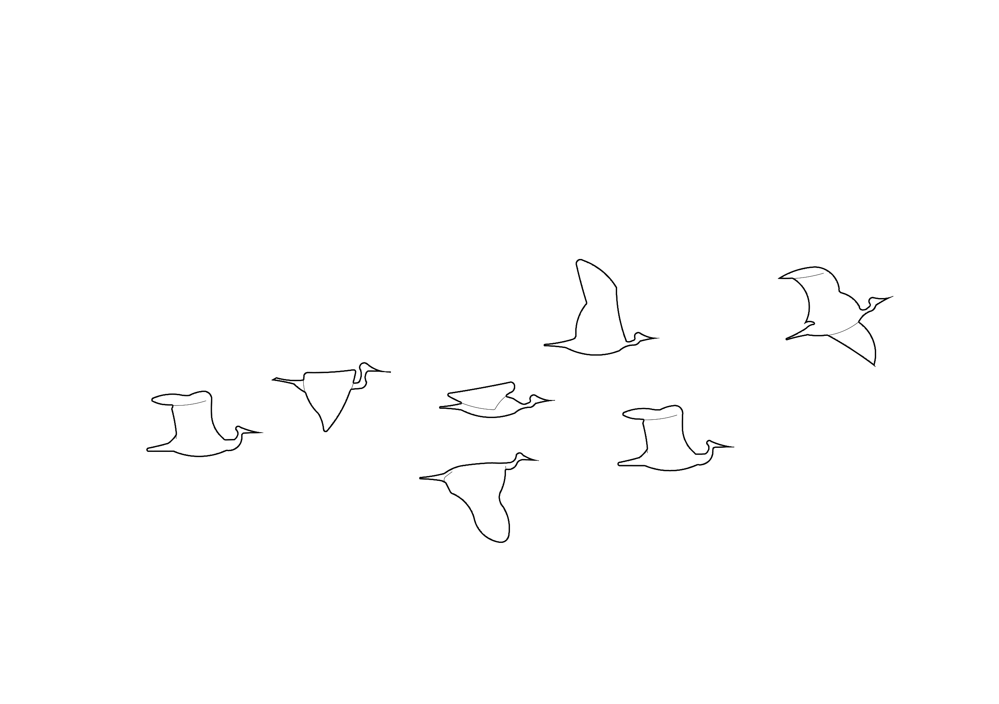

```{=html}
<!-- ============ TOP BAR ============ -->
<header class="topbar" id="topbar">
  <div class="topbar-inner">
    <a href="#top" class="brand">
      <span class="brand-mark"></span>
      <span class="brand-text">
        <span class="brand-title">Shorebird Habitat</span>
        <span class="brand-sub">Lianyungang · Jiangsu</span>
      </span>
    </a>
    <div class="topbar-right">
      <span class="topbar-meta">CASA0025 · Spatial research case study</span>
      <a href="#application" class="btn btn-primary btn-sm">Open the tool</a>
    </div>
  </div>
</header>

<!-- ============ HERO ============ -->
<section class="hero" id="top">
  <div class="hero-bg" aria-hidden="true">
    <svg class="hero-svg" viewBox="0 0 1600 900" preserveAspectRatio="xMidYMid slice">
      <defs>
        <linearGradient id="sky" x1="0" x2="0" y1="0" y2="1">
          <stop offset="0%" stop-color="#0d2a4a"/>
          <stop offset="55%" stop-color="#1f4f86"/>
          <stop offset="100%" stop-color="#3c91e6"/>
        </linearGradient>
        <linearGradient id="flat" x1="0" x2="0" y1="0" y2="1">
          <stop offset="0%" stop-color="#3c91e6" stop-opacity="0.95"/>
          <stop offset="100%" stop-color="#9fd356" stop-opacity="0.85"/>
        </linearGradient>
        <radialGradient id="sun" cx="0.78" cy="0.18" r="0.25">
          <stop offset="0%" stop-color="#fa824c" stop-opacity="0.95"/>
          <stop offset="100%" stop-color="#fa824c" stop-opacity="0"/>
        </radialGradient>
      </defs>
      <rect width="1600" height="900" fill="url(#sky)"/>
      <rect width="1600" height="900" fill="url(#sun)"/>
      <path d="M0 540 C 220 510, 360 560, 540 540 S 920 500, 1100 540 S 1400 580, 1600 530 L 1600 600 L 0 600 Z" fill="#1a3d68" opacity="0.7"/>
      <path d="M0 600 C 200 580, 360 620, 540 600 S 920 580, 1100 600 S 1400 640, 1600 600 L 1600 720 L 0 720 Z" fill="url(#flat)" opacity="0.55"/>
      <path d="M0 720 C 200 700, 360 740, 540 720 S 920 700, 1100 720 S 1400 760, 1600 720 L 1600 900 L 0 900 Z" fill="#3c91e6" opacity="0.45"/>
    </svg>
    <div class="hero-vignette"></div>
    
  </div>

  <div class="hero-content">
    <div class="hero-eyebrow">CASA0025 · Spatial research case study · 2026</div>
    <h1 class="hero-title">Shorebird Habitat<br/><em>Assessment</em></h1>
    <p class="hero-place">Lianyungang Coastal Wetland · Jiangsu · China</p>
    <p class="hero-sub">An interactive spatial decision-support platform combining tidal-flat dynamics, proximity modelling, and habitat suitability analysis for migratory shorebirds.</p>

    <div class="hero-actions">
      <a href="#application" class="btn btn-primary btn-lg">Explore the tool →</a>
      <a href="#methodology" class="btn btn-ghost btn-lg">Learn methodology</a>
    </div>

    <div class="hero-meta">
      <span><strong>Region</strong> · Jiangsu Province, China</span>
      <span><strong>Flyway</strong> · East Asian–Australasian</span>
      <span><strong>Engine</strong> · Google Earth Engine</span>
    </div>
  </div>

  <a href="#summary" class="scroll-cue" aria-label="Scroll to project summary">
    <span></span>
  </a>
</section>

<!-- ============ CASE STUDY LAYOUT ============ -->
<div class="case-study">
  <!-- LEFT TOC -->
  <aside class="toc" id="toc" aria-label="Section contents">
    <button class="toc-chip-btn" id="tocChipBtn" aria-expanded="false" aria-controls="toc">
      <svg width="14" height="14" viewBox="0 0 24 24" fill="none" stroke="currentColor" stroke-width="2.2" stroke-linecap="round"><path d="M3 6h18M3 12h18M3 18h18"/></svg>
      <span>Contents</span>
      <svg class="toc-chevron" width="12" height="12" viewBox="0 0 24 24" fill="none" stroke="currentColor" stroke-width="2.4" stroke-linecap="round" stroke-linejoin="round"><path d="m6 9 6 6 6-6"/></svg>
    </button>
    <div class="toc-inner">
      <div class="toc-label">Contents</div>
      <ol class="toc-list">
        <li><a href="#summary"     data-num="01">Project Summary</a></li>
        <li><a href="#problem"     data-num="02">Problem Statement</a></li>
        <li><a href="#users"       data-num="03">End User</a></li>
        <li><a href="#data"        data-num="04">Data</a></li>
        <li><a href="#methodology" data-num="05">Methodology</a></li>
        <li><a href="#interface"   data-num="06">Interface</a></li>
        <li><a href="#application" data-num="07">The Application</a></li>
        <li><a href="#how"         data-num="08">How it Works</a></li>
        <li><a href="#references"  data-num="09">References</a></li>
      </ol>
      <div class="toc-foot">
        <a href="https://ee-summerxxxa99.projects.earthengine.app/view/shorebird-habitat-explorer" target="_blank" rel="noopener" class="toc-link-out">
          Open full app
          <svg width="12" height="12" viewBox="0 0 24 24" fill="none" stroke="currentColor" stroke-width="2.5"><path d="M7 17L17 7M7 7h10v10"/></svg>
        </a>
      </div>
    </div>
  </aside>

  <!-- RIGHT ARTICLE -->
  <article class="article">

    <!-- 01 PROJECT SUMMARY -->
    <section id="summary" class="section section-wide">
      
      <div class="section-head fade-in">
        <span class="section-num">01</span>
        <span class="section-tag">Project Summary</span>
      </div>
      <h2 class="section-title fade-in">An interactive lens on coastal habitat health</h2>
      <p class="lede fade-in">This platform evaluates shorebird habitat quality in Lianyungang coastal wetlands using remote sensing and spatial ecological indicators. It turns an Earth Engine workflow into a decision-support interface where managers, planners, and researchers reason directly with the spatial evidence.</p>

      <div class="summary-stats fade-in">
        <div class="stat">
          <span class="stat-num">3</span>
          <span class="stat-label">Analytical modules</span>
        </div>
        <div class="stat">
          <span class="stat-num">2014–24</span>
          <span class="stat-label">Decade of imagery</span>
        </div>
        <div class="stat">
          <span class="stat-num">~1,200<small>km²</small></span>
          <span class="stat-label">Study extent</span>
        </div>
        <div class="stat">
          <span class="stat-num">EAAF</span>
          <span class="stat-label">Migratory flyway</span>
        </div>
      </div>
    </section>

    <hr class="rule"/>

    <!-- 02 PROBLEM STATEMENT -->
    <section id="problem" class="section section-wide">
      <div class="section-head fade-in">
        <span class="section-num">02</span>
        <span class="section-tag">Problem Statement</span>
      </div>
      <h2 class="section-title fade-in">Coastal wetlands are losing their connective tissue</h2>
      <p class="lede fade-in">The Yellow Sea is one of the most pressured coastal systems on Earth, and its tidal flats are keystone habitat for shorebirds on the East Asian–Australasian Flyway. Five concurrent pressures shape the conservation question.</p>

      <ul class="problem-list">
        <li class="fade-in">
          <div class="bullet-num">01</div>
          <h3>Tidal-flat habitat loss</h3>
          <p>Reclamation and aquaculture have shrunk tidal-flat extent across the Lianyungang coastline.</p>
        </li>
        <li class="fade-in">
          <div class="bullet-num">02</div>
          <h3>Wetland fragmentation</h3>
          <p>Remaining flats and marshes are increasingly disconnected from one another.</p>
        </li>
        <li class="fade-in">
          <div class="bullet-num">03</div>
          <h3>Pressure from development</h3>
          <p>Ports, embankments, and aquaculture continue to compete for the land–sea interface.</p>
        </li>
        <li class="fade-in">
          <div class="bullet-num">04</div>
          <h3>Need for fast prioritisation</h3>
          <p>Limited conservation budgets need spatially explicit answers, not generic reports.</p>
        </li>
        <li class="fade-in">
          <div class="bullet-num">05</div>
          <h3>Migratory significance</h3>
          <p>Local choices in Lianyungang have flyway-scale consequences for migratory shorebirds.</p>
        </li>
      </ul>
    </section>

    <hr class="rule"/>

    <!-- 03 END USER -->
    <section id="users" class="section section-wide">
      <div class="section-head fade-in">
        <span class="section-num">03</span>
        <span class="section-tag">End User</span>
      </div>
      <h2 class="section-title fade-in">Designed for people making decisions on the ground</h2>
      <p class="lede fade-in">The interface is shaped by the workflow of practitioners — short reasoning loops, clear visual evidence, and language that travels between technical and non-technical audiences.</p>

      <ul class="user-stack">
        <li class="user-row fade-in">
          <div class="user-icon">
            <svg viewBox="0 0 24 24" fill="none" stroke="currentColor" stroke-width="1.6"><path d="M3 21V10l9-7 9 7v11"/><path d="M9 21v-7h6v7"/></svg>
          </div>
          <div class="user-row-text">
            <h3>Conservation agencies</h3>
            <p>Statutory bodies prioritising restoration and monitoring across coastal districts.</p>
          </div>
          <div class="user-row-tag">01 · Statutory</div>
        </li>
        <li class="user-row fade-in">
          <div class="user-icon">
            <svg viewBox="0 0 24 24" fill="none" stroke="currentColor" stroke-width="1.6"><rect x="3" y="3" width="18" height="18" rx="2"/><path d="M3 9h18M9 3v18"/></svg>
          </div>
          <div class="user-row-text">
            <h3>Coastal planners</h3>
            <p>Spatial planners weighing development against ecological function at the land–sea boundary.</p>
          </div>
          <div class="user-row-tag">02 · Planning</div>
        </li>
        <li class="user-row fade-in">
          <div class="user-icon">
            <svg viewBox="0 0 24 24" fill="none" stroke="currentColor" stroke-width="1.6"><circle cx="11" cy="11" r="7"/><path d="m21 21-4.35-4.35"/></svg>
          </div>
          <div class="user-row-text">
            <h3>Researchers</h3>
            <p>Ecologists and remote-sensing scientists exploring habitat structure and temporal change.</p>
          </div>
          <div class="user-row-tag">03 · Research</div>
        </li>
        <li class="user-row fade-in">
          <div class="user-icon">
            <svg viewBox="0 0 24 24" fill="none" stroke="currentColor" stroke-width="1.6"><path d="M12 21s-7-4.5-7-10a7 7 0 0 1 14 0c0 5.5-7 10-7 10z"/><circle cx="12" cy="11" r="2.5"/></svg>
          </div>
          <div class="user-row-text">
            <h3>NGOs &amp; local groups</h3>
            <p>Field organisations advocating for evidence-based wetland protection and outreach.</p>
          </div>
          <div class="user-row-tag">04 · Advocacy</div>
        </li>
        <li class="user-row fade-in">
          <div class="user-icon">
            <svg viewBox="0 0 24 24" fill="none" stroke="currentColor" stroke-width="1.6"><path d="M22 10 12 4 2 10l10 6 10-6Z"/><path d="M6 12v5c0 1.1 2.7 3 6 3s6-1.9 6-3v-5"/></svg>
          </div>
          <div class="user-row-text">
            <h3>Students</h3>
            <p>Postgraduates working with GEE-based habitat assessment and geocomputation.</p>
          </div>
          <div class="user-row-tag">05 · Education</div>
        </li>
      </ul>
    </section>

    <hr class="rule"/>

    <!-- 04 DATA -->
    <section id="data" class="section section-wide">
      <div class="section-head fade-in">
        <span class="section-num">04</span>
        <span class="section-tag">Data</span>
      </div>
      <h2 class="section-title fade-in">Layered inputs from imagery to ecology</h2>
      <p class="lede fade-in">Inputs are drawn from open remote-sensing archives and ecological literature. Asset paths are kept inside the technical documentation; the public interface is written in ecological language.</p>

      <div class="data-table-wrap fade-in">
        <table class="data-table">
          <thead>
            <tr>
              <th class="th-cat">Category</th>
              <th>Dataset</th>
              <th>Description</th>
              <th class="th-src">Source</th>
            </tr>
          </thead>
          <tbody>
            <tr>
              <th rowspan="3" scope="rowgroup" class="data-cat"><span>GEE</span></th>
              <td>Sentinel-2 SR Harmonized</td>
              <td>Multi-temporal optical imagery used for tidal-flat segmentation.</td>
              <td><a href="https://developers.google.com/earth-engine/datasets/catalog/COPERNICUS_S2_SR_HARMONIZED" target="_blank" rel="noopener">Link →</a></td>
            </tr>
            <tr>
              <td>Landsat 8 OLI Surface Reflectance</td>
              <td>Long-term coastal observation archive (2014–2024).</td>
              <td><a href="https://developers.google.com/earth-engine/datasets/catalog/LANDSAT_LC08_C02_T1_L2" target="_blank" rel="noopener">Link →</a></td>
            </tr>
            <tr>
              <td>JRC Global Surface Water</td>
              <td>Persistent water mask supporting tidal-flat extraction.</td>
              <td><a href="https://developers.google.com/earth-engine/datasets/catalog/JRC_GSW1_4_GlobalSurfaceWater" target="_blank" rel="noopener">Link →</a></td>
            </tr>
            <tr>
              <th rowspan="2" scope="rowgroup" class="data-cat"><span>Habitat</span></th>
              <td>Annual tidal-flat layers</td>
              <td>Per-year tidal-flat masks for 2014, 2019, and 2024.</td>
              <td><span class="data-link-muted">Custom asset</span></td>
            </tr>
            <tr>
              <td>Roost vegetation patches</td>
              <td>Coastal salt marsh and reedbed polygons used as roost candidates.</td>
              <td><span class="data-link-muted">Custom asset</span></td>
            </tr>
            <tr>
              <th scope="row" class="data-cat"><span>Boundary</span></th>
              <td>Study area</td>
              <td>Lianyungang Coastal Wetland boundary clip.</td>
              <td><span class="data-link-muted">Custom asset</span></td>
            </tr>
            <tr>
              <th scope="row" class="data-cat"><span>Knowledge</span></th>
              <td>Literature thresholds</td>
              <td>Movement-distance ranges drawn from shorebird ecology literature.</td>
              <td><a href="#references">References ↓</a></td>
            </tr>
          </tbody>
        </table>
      </div>
    </section>

    <hr class="rule"/>

    <!-- 05 METHODOLOGY -->
    <section id="methodology" class="section section-wide">
      <div class="section-head fade-in">
        <span class="section-num">05</span>
        <span class="section-tag">Methodology</span>
      </div>
      <h2 class="section-title fade-in">From raw imagery to a decision-ready habitat surface</h2>
      <p class="lede fade-in">The pipeline is built from five chained stages. Each stage is encapsulated as an Earth Engine module so users reason about the analysis in steps, not as a black box.</p>

      <div class="method-rows">
        <article class="method-row fade-in">
          <div class="method-text">
            <span class="m-num">01</span>
            <h3>Proximity Analysis</h3>
            <p>Distance surfaces are computed outwards from roost vegetation patches. Tidal-flat habitat is queried against these surfaces to test whether feeding habitat lies within suitable movement range.</p>
          </div>
          <div class="method-media placeholder-img" data-num="01">
            <span class="placeholder-tag">Method 01 · placeholder</span>
          </div>
        </article>

        <article class="method-row reverse fade-in">
          <div class="method-text">
            <span class="m-num">02</span>
            <h3>Tidal-flat Change Detection</h3>
            <p>Per-year tidal-flat masks are differenced into three change classes — stable, gain, and loss — across selected baseline / comparison years.</p>
          </div>
          <div class="method-media placeholder-img" data-num="02">
            <span class="placeholder-tag">Method 02 · placeholder</span>
          </div>
        </article>

        <article class="method-row fade-in">
          <div class="method-text">
            <span class="m-num">03</span>
            <h3>Habitat Priority Classification</h3>
            <p>Distance-based accessibility is combined with habitat coverage to identify well-served habitat, habitat gaps, connected roosts, and isolated roosts.</p>
          </div>
          <div class="method-media placeholder-img" data-num="03">
            <span class="placeholder-tag">Method 03 · placeholder</span>
          </div>
        </article>

        <article class="method-row reverse fade-in">
          <div class="method-text">
            <span class="m-num">04</span>
            <h3>Threshold-based Scoring</h3>
            <p>User-defined ecological thresholds reclassify habitat on demand, exposing how sensitive the decision surface is to assumption.</p>
          </div>
          <div class="method-media placeholder-img" data-num="04">
            <span class="placeholder-tag">Method 04 · placeholder</span>
          </div>
        </article>

        <article class="method-row fade-in">
          <div class="method-text">
            <span class="m-num">05</span>
            <h3>Interactive Geovisualisation</h3>
            <p>All outputs are surfaced through a single Earth Engine app — sliders, dropdowns, charts, and click-driven popups — so the user becomes the analyst.</p>
          </div>
          <div class="method-media placeholder-img" data-num="05">
            <span class="placeholder-tag">Method 05 · placeholder</span>
          </div>
        </article>
      </div>
    </section>

    <hr class="rule"/>

    <!-- 06 INTERFACE -->
    <section id="interface" class="section section-wide">
      <div class="section-head fade-in">
        <span class="section-num">06</span>
        <span class="section-tag">Interface</span>
      </div>
      <h2 class="section-title fade-in">Six controls that turn a script into a tool</h2>
      <p class="lede fade-in">The interactive interface is narrow in scope by design — six core controls cover everything a user needs to test a habitat hypothesis without leaving the map.</p>

      <div class="iface-grid">
        <article class="iface-card fade-in">
          <div class="iface-media placeholder-img" data-num="01">
            <span class="placeholder-tag">UI 01 · placeholder</span>
          </div>
          <div class="iface-body">
            <div class="iface-icon">
              <svg viewBox="0 0 24 24" fill="none" stroke="currentColor" stroke-width="1.6"><rect x="3" y="6" width="18" height="3" rx="1"/><rect x="3" y="12" width="12" height="3" rx="1"/><rect x="3" y="18" width="6" height="3" rx="1"/></svg>
            </div>
            <h3>Analysis mode selector</h3>
            <p>Switches between Proximity, Change, and Priority modules without leaving the map.</p>
          </div>
        </article>
        <article class="iface-card fade-in">
          <div class="iface-media placeholder-img" data-num="02">
            <span class="placeholder-tag">UI 02 · placeholder</span>
          </div>
          <div class="iface-body">
            <div class="iface-icon">
              <svg viewBox="0 0 24 24" fill="none" stroke="currentColor" stroke-width="1.6"><rect x="3" y="4" width="18" height="18" rx="2"/><path d="M16 2v4M8 2v4M3 10h18"/></svg>
            </div>
            <h3>Year comparison tools</h3>
            <p>Baseline / comparison year dropdowns for 2014, 2019, and 2024 imagery.</p>
          </div>
        </article>
        <article class="iface-card fade-in">
          <div class="iface-media placeholder-img" data-num="03">
            <span class="placeholder-tag">UI 03 · placeholder</span>
          </div>
          <div class="iface-body">
            <div class="iface-icon">
              <svg viewBox="0 0 24 24" fill="none" stroke="currentColor" stroke-width="1.6"><line x1="3" y1="12" x2="21" y2="12"/><circle cx="9" cy="12" r="3"/></svg>
            </div>
            <h3>Threshold sliders</h3>
            <p>Continuous sliders for optimal, sub-optimal, and conservation thresholds.</p>
          </div>
        </article>
        <article class="iface-card fade-in">
          <div class="iface-media placeholder-img" data-num="04">
            <span class="placeholder-tag">UI 04 · placeholder</span>
          </div>
          <div class="iface-body">
            <div class="iface-icon">
              <svg viewBox="0 0 24 24" fill="none" stroke="currentColor" stroke-width="1.6"><path d="M3 12h4l3 8 4-16 3 8h4"/></svg>
            </div>
            <h3>Results panel</h3>
            <p>Live area summaries and bar / donut charts that update in step with the map.</p>
          </div>
        </article>
        <article class="iface-card fade-in">
          <div class="iface-media placeholder-img" data-num="05">
            <span class="placeholder-tag">UI 05 · placeholder</span>
          </div>
          <div class="iface-body">
            <div class="iface-icon">
              <svg viewBox="0 0 24 24" fill="none" stroke="currentColor" stroke-width="1.6"><rect x="3" y="4" width="18" height="16" rx="2"/><circle cx="8" cy="9" r="1.5"/><circle cx="8" cy="15" r="1.5"/><line x1="12" y1="9" x2="18" y2="9"/><line x1="12" y1="15" x2="18" y2="15"/></svg>
            </div>
            <h3>Dynamic legend</h3>
            <p>Map legend that re-renders to match the active module's class palette.</p>
          </div>
        </article>
        <article class="iface-card fade-in">
          <div class="iface-media placeholder-img" data-num="06">
            <span class="placeholder-tag">UI 06 · placeholder</span>
          </div>
          <div class="iface-body">
            <div class="iface-icon">
              <svg viewBox="0 0 24 24" fill="none" stroke="currentColor" stroke-width="1.6"><path d="M9 11.4 12 14l3-6.5L19 9l-1 8H6l-1-8 4 1.5z"/></svg>
            </div>
            <h3>Click interactions</h3>
            <p>Per-zone popups with class, area, and a short ecological interpretation.</p>
          </div>
        </article>
      </div>
    </section>

    <hr class="rule"/>

    <!-- 07 THE APPLICATION -->
    <section id="application" class="section section-wide">
      <div class="section-head fade-in">
        <span class="section-num">07</span>
        <span class="section-tag">The Application</span>
      </div>
      <h2 class="section-title fade-in">The live habitat explorer</h2>
      <p class="lede fade-in">The full Earth Engine application is embedded below. Use the panel on the left of the embedded app to switch modules, adjust thresholds, and run analyses; the map updates immediately.</p>

      <figure class="gee-figure">
        <div class="gee-frame">
          <iframe
            title="Shorebird Habitat Explorer — Google Earth Engine App"
            src="https://ee-summerxxxa99.projects.earthengine.app/view/shorebird-habitat-explorer"
            loading="lazy"
            allow="fullscreen"
            referrerpolicy="no-referrer-when-downgrade">
          </iframe>
          <div class="gee-loading" id="geeLoading">
            <span class="spinner"></span>
            <span>Loading the Earth Engine app…</span>
          </div>
        </div>
        <figcaption class="gee-caption">
          <span>Live interactive habitat explorer powered by Google Earth Engine.</span>
          <a href="https://ee-summerxxxa99.projects.earthengine.app/view/shorebird-habitat-explorer" target="_blank" rel="noopener" class="caption-link">
            Open in a new tab
            <svg width="12" height="12" viewBox="0 0 24 24" fill="none" stroke="currentColor" stroke-width="2.5"><path d="M7 17L17 7M7 7h10v10"/></svg>
          </a>
        </figcaption>
      </figure>
    </section>

    <hr class="rule"/>

    <!-- 08 HOW IT WORKS -->
    <section id="how" class="section section-wide">
      <div class="section-head fade-in">
        <span class="section-num">08</span>
        <span class="section-tag">How it Works</span>
      </div>
      <h2 class="section-title fade-in">Six steps from a question to a decision</h2>
      <p class="lede fade-in">The interaction loop is short by design. Each step in the explorer maps to a small slice of Earth Engine code — copy any block to inspect or adapt it.</p>

      <ol class="how-grid">
        <li class="how-card fade-in">
          <header class="how-card-head">
            <div class="how-num">1</div>
            <div>
              <h3>Select mode</h3>
              <p>Pick Proximity, Change Detection, or Priority depending on the question.</p>
            </div>
          </header>
          <div class="code-block">
            <div class="code-block-head">
              <span class="code-lang">javascript</span>
              <button class="code-copy" type="button" aria-label="Copy code">
                <svg width="14" height="14" viewBox="0 0 24 24" fill="none" stroke="currentColor" stroke-width="2" stroke-linecap="round" stroke-linejoin="round"><rect x="9" y="9" width="13" height="13" rx="2"/><path d="M5 15H4a2 2 0 0 1-2-2V4a2 2 0 0 1 2-2h9a2 2 0 0 1 2 2v1"/></svg>
                <span class="code-copy-label">Copy</span>
              </button>
            </div>
<pre><code>// Step 1 — choose the analysis module
var mode = ui.Select({
  items: ['Proximity', 'Change', 'Priority'],
  value: 'Proximity'
});</code></pre>
          </div>
        </li>

        <li class="how-card fade-in">
          <header class="how-card-head">
            <div class="how-num">2</div>
            <div>
              <h3>Choose years or thresholds</h3>
              <p>Set baseline / comparison years, or movement-distance thresholds.</p>
            </div>
          </header>
          <div class="code-block">
            <div class="code-block-head">
              <span class="code-lang">javascript</span>
              <button class="code-copy" type="button" aria-label="Copy code">
                <svg width="14" height="14" viewBox="0 0 24 24" fill="none" stroke="currentColor" stroke-width="2" stroke-linecap="round" stroke-linejoin="round"><rect x="9" y="9" width="13" height="13" rx="2"/><path d="M5 15H4a2 2 0 0 1-2-2V4a2 2 0 0 1 2-2h9a2 2 0 0 1 2 2v1"/></svg>
                <span class="code-copy-label">Copy</span>
              </button>
            </div>
<pre><code>// Step 2 — set parameters
var baseYear = 2014;
var compYear = 2024;
var optKm = 2.5, subKm = 5.0, marKm = 8.0;</code></pre>
          </div>
        </li>

        <li class="how-card fade-in">
          <header class="how-card-head">
            <div class="how-num">3</div>
            <div>
              <h3>Run analysis</h3>
              <p>Execute the chosen module — Earth Engine processes the imagery in the cloud.</p>
            </div>
          </header>
          <div class="code-block">
            <div class="code-block-head">
              <span class="code-lang">javascript</span>
              <button class="code-copy" type="button" aria-label="Copy code">
                <svg width="14" height="14" viewBox="0 0 24 24" fill="none" stroke="currentColor" stroke-width="2" stroke-linecap="round" stroke-linejoin="round"><rect x="9" y="9" width="13" height="13" rx="2"/><path d="M5 15H4a2 2 0 0 1-2-2V4a2 2 0 0 1 2-2h9a2 2 0 0 1 2 2v1"/></svg>
                <span class="code-copy-label">Copy</span>
              </button>
            </div>
<pre><code>// Step 3 — run the proximity pipeline
var distance = roosts.distance().clip(studyArea);
var classes  = distance
  .where(distance.lte(optKm * 1000), 1)
  .where(distance.gt(optKm * 1000).and(distance.lte(subKm * 1000)), 2);</code></pre>
          </div>
        </li>

        <li class="how-card fade-in">
          <header class="how-card-head">
            <div class="how-num">4</div>
            <div>
              <h3>Inspect outputs</h3>
              <p>Read map layers, area cards, and module-specific charts as they update.</p>
            </div>
          </header>
          <div class="code-block">
            <div class="code-block-head">
              <span class="code-lang">javascript</span>
              <button class="code-copy" type="button" aria-label="Copy code">
                <svg width="14" height="14" viewBox="0 0 24 24" fill="none" stroke="currentColor" stroke-width="2" stroke-linecap="round" stroke-linejoin="round"><rect x="9" y="9" width="13" height="13" rx="2"/><path d="M5 15H4a2 2 0 0 1-2-2V4a2 2 0 0 1 2-2h9a2 2 0 0 1 2 2v1"/></svg>
                <span class="code-copy-label">Copy</span>
              </button>
            </div>
<pre><code>// Step 4 — push results to the map and panel
Map.addLayer(classes, accVis, 'Accessibility');
panel.add(ui.Chart.image.byClass(classes, 'class', studyArea));</code></pre>
          </div>
        </li>

        <li class="how-card fade-in">
          <header class="how-card-head">
            <div class="how-num">5</div>
            <div>
              <h3>Compare habitat patterns</h3>
              <p>Switch modules and parameters to triangulate where habitat is fragile.</p>
            </div>
          </header>
          <div class="code-block">
            <div class="code-block-head">
              <span class="code-lang">javascript</span>
              <button class="code-copy" type="button" aria-label="Copy code">
                <svg width="14" height="14" viewBox="0 0 24 24" fill="none" stroke="currentColor" stroke-width="2" stroke-linecap="round" stroke-linejoin="round"><rect x="9" y="9" width="13" height="13" rx="2"/><path d="M5 15H4a2 2 0 0 1-2-2V4a2 2 0 0 1 2-2h9a2 2 0 0 1 2 2v1"/></svg>
                <span class="code-copy-label">Copy</span>
              </button>
            </div>
<pre><code>// Step 5 — overlay change against priority
var stable = flat14.and(flat24);
var loss   = flat14.and(flat24.not());
var priority = classes.eq(3).or(loss);</code></pre>
          </div>
        </li>

        <li class="how-card fade-in">
          <header class="how-card-head">
            <div class="how-num">6</div>
            <div>
              <h3>Support decisions</h3>
              <p>Take the priority surface into a planning, restoration, or advocacy context.</p>
            </div>
          </header>
          <div class="code-block">
            <div class="code-block-head">
              <span class="code-lang">javascript</span>
              <button class="code-copy" type="button" aria-label="Copy code">
                <svg width="14" height="14" viewBox="0 0 24 24" fill="none" stroke="currentColor" stroke-width="2" stroke-linecap="round" stroke-linejoin="round"><rect x="9" y="9" width="13" height="13" rx="2"/><path d="M5 15H4a2 2 0 0 1-2-2V4a2 2 0 0 1 2-2h9a2 2 0 0 1 2 2v1"/></svg>
                <span class="code-copy-label">Copy</span>
              </button>
            </div>
<pre><code>// Step 6 — export the priority surface
Export.image.toDrive({
  image: priority,
  region: studyArea,
  scale: 30,
  description: 'lianyungang_priority_2024'
});</code></pre>
          </div>
        </li>
      </ol>
    </section>

    <hr class="rule"/>

    <!-- 09 REFERENCES -->
    <section id="references" class="section section-narrow">
      <div class="section-head fade-in">
        <span class="section-num">09</span>
        <span class="section-tag">References</span>
      </div>
      <h2 class="section-title fade-in">References & further reading</h2>

      <ul class="ref-list">
        <li class="fade-in">
          <span class="ref-key">Ma et al. (2023)</span>
          <span class="ref-body">Tidal-flat dynamics and shorebird habitat assessment along the western Yellow Sea using Google Earth Engine. <em>Remote Sensing of Environment</em>.</span>
        </li>
        <li class="fade-in">
          <span class="ref-key">Rogers et al. (2006)</span>
          <span class="ref-body">High-tide habitat choice: insights from modelling roost selection by shorebirds around a tropical bay. <em>Animal Behaviour</em>, 72(3), 563–575.</span>
        </li>
        <li class="fade-in">
          <span class="ref-key">Murray, N. J. et al. (2019)</span>
          <span class="ref-body">The global distribution and trajectory of tidal flats. <em>Nature</em>, 565, 222–225.</span>
        </li>
        <li class="fade-in">
          <span class="ref-key">Studds, C. E. et al. (2017)</span>
          <span class="ref-body">Rapid population decline in migratory shorebirds relying on Yellow Sea tidal mudflats as stopover sites. <em>Nature Communications</em>, 8, 14895.</span>
        </li>
        <li class="fade-in">
          <span class="ref-key">Google Earth Engine</span>
          <span class="ref-body">Earth Engine Documentation. developers.google.com/earth-engine — accessed 2026.</span>
        </li>
      </ul>

      <div class="ref-foot fade-in">
        Built for CASA0025 · UCL Centre for Advanced Spatial Analysis · 2026.
      </div>
    </section>

  </article>
</div>

<!-- ============ FOOTER ============ -->
<footer class="site-footer">
  <div class="footer-inner">
    <div class="footer-brand">
      <span class="brand-mark"></span>
      <span>Shorebird Habitat Assessment — Lianyungang Coastal Wetland</span>
    </div>
    <small>Powered by Google Earth Engine · CASA0025 · 2026</small>
  </div>
</footer>
```
